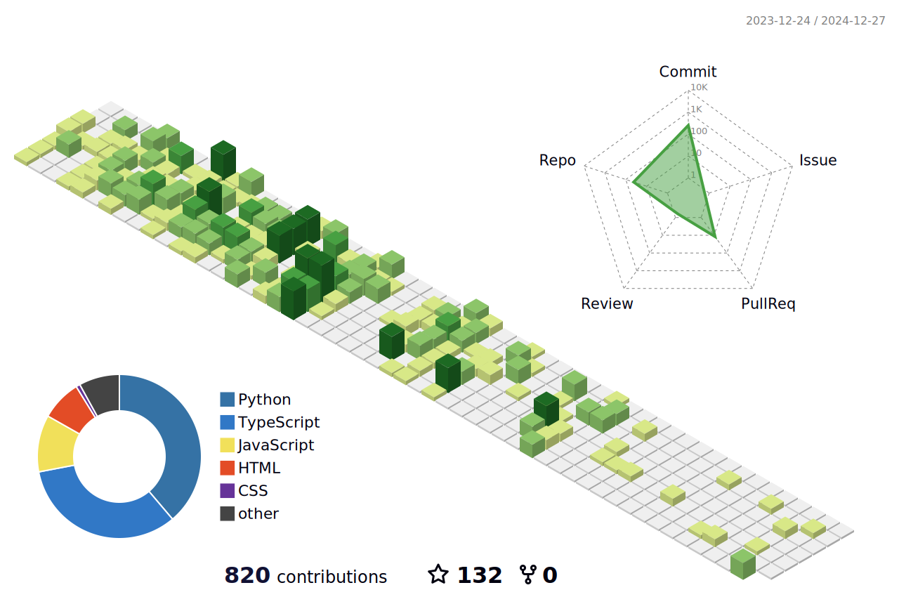

<h3 align="center">Full Stack || Mobile Developer</h3>

<h3 align="left">🖋️ SUMMARY</h3>

I'm a Full Stack Developer with over 9 years of experience in designing, developing, and deploying web applications.I have expertise in both front-end and back-end technologies, including JavaScript, Python, Next.js, React, Angular, and Django, and are skilled in database management with SQL and NoSQL.I have a proven track record of enhancing user experience and optimizing application performance using Agile methodologies. I seek to contribute to a company with a strong long-term strategy, where I can grow alongside a professional team.

    

        <picture>
            <source media="(prefers-color-scheme: dark)" srcset="https://github-readme-activity-graph.vercel.app/graph?username=BlackLegSanji124&theme=vue&hide_border=false&hide_title=false&area=true&custom_title=Monthly%20Contribution%20Overview%20Across%20All%20Repositories" />
            <source media="(prefers-color-scheme: light)" srcset="https://github-readme-activity-graph.vercel.app/graph?username=BlackLegSanji124&theme=github-light&hide_border=false&hide_title=false&area=true&custom_title=Monthly%20Contribution%20Overview%20Across%20All%20Repositories" />
            
        </picture>
    

 

 
 

 

    

        <picture>
            <!-- Dark theme -->
            <source media="(prefers-color-scheme: dark)" srcset="https://github-profile-trophy.vercel.app/?username=BlackLegSanji124&theme=onestar&no-frame=true&column=8&row=1" />
            <!-- Light theme -->
            <source media="(prefers-color-scheme: light)" srcset="https://github-profile-trophy.vercel.app/?username=BlackLegSanji124&theme=onedark&no-frame=true&column=8&row=1" />
            <!-- Fallback image -->
            
        </picture>
    

 

